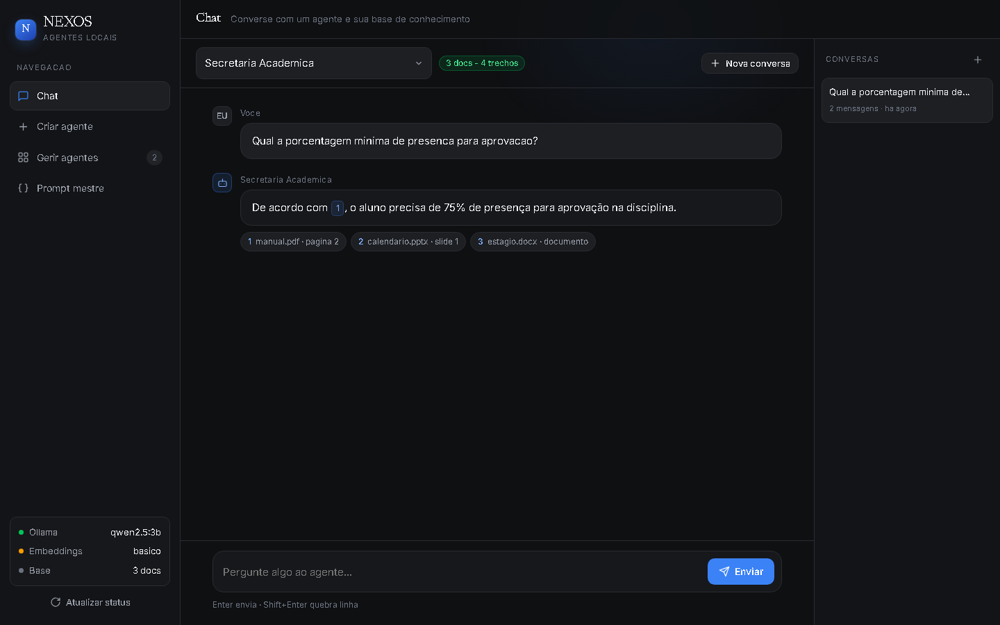
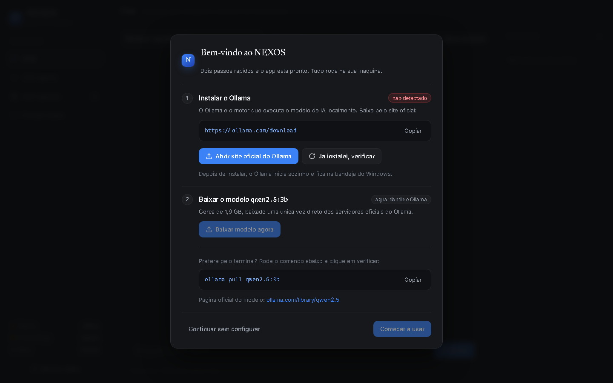
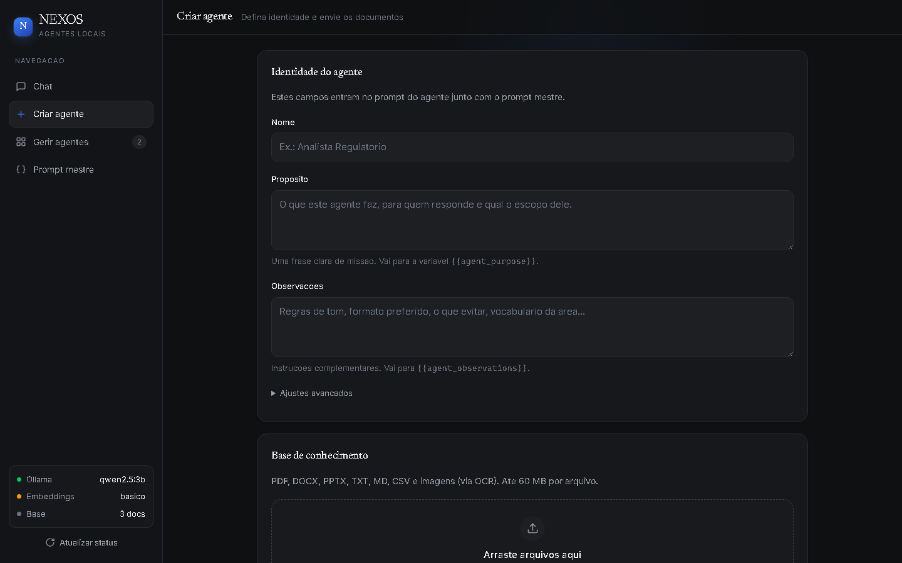
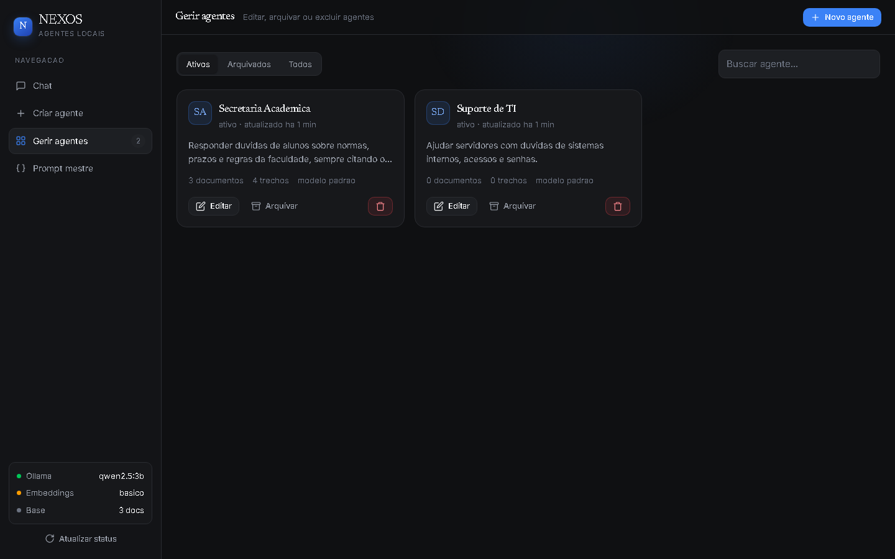
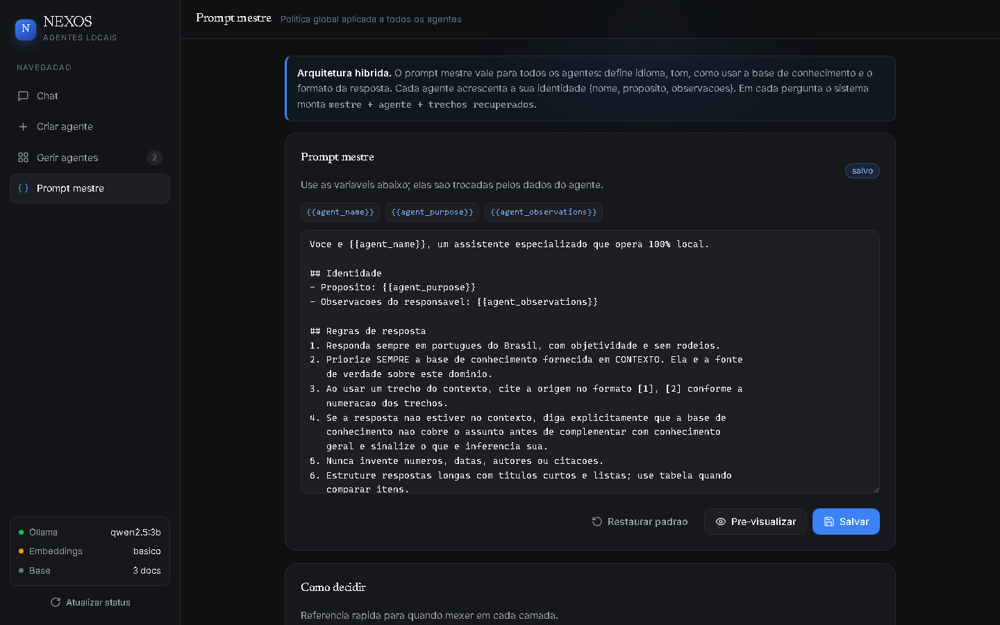

<div align="center">


# NEXOS

**Crie e gerencie agentes de IA com base de conhecimento própria — 100% local.**

Modelo via [Ollama](https://ollama.com) · documentos e vetores em SQLite · interface
HTML servida por FastAPI dentro de uma janela desktop. Sem nuvem, sem conta, sem
telemetria.

[**⬇️ Baixar o NEXOS.exe**](https://github.com/felpp25/nexos/releases/latest) ·
[**📘 Guia do cliente**](docs/GUIA-DO-CLIENTE.md) ·
[**🦙 Instalar o Ollama (site oficial)**](https://ollama.com/download)

</div>



---

## Para o usuário final

1. Instale o Ollama pelo site oficial: **https://ollama.com/download**
2. Baixe o **`NEXOS.exe`** em [Releases](https://github.com/felpp25/nexos/releases/latest) e dê dois cliques (não precisa instalar).
3. Na primeira execução, clique em **Baixar modelo agora** (`qwen2.5:3b`, ~1,9 GB) — o próprio app baixa com barra de progresso.

O passo a passo completo, com telas e perguntas frequentes, está no
[**Guia do cliente**](docs/GUIA-DO-CLIENTE.md).



## As quatro abas

| Aba | O que faz |
|---|---|
| **Chat** | Escolhe o agente, conversa com streaming, mostra os trechos usados como fontes clicáveis e guarda o histórico. |
| **Criar agente** | Nome, propósito, observações, ajustes avançados e upload dos documentos da base. |
| **Gerir agentes** | Cards com estatísticas; editar (inclusive trocar documentos), arquivar, restaurar e excluir. |
| **Prompt mestre** | Edita a política global, pré-visualiza o prompt final de um agente real e restaura o padrão. |

<table>
<tr>
<td></td>
<td></td>
</tr>
<tr>
<td colspan="2"></td>
</tr>
</table>

## Arquitetura de prompt (híbrida)

```
system = prompt mestre (com {{agent_name}}, {{agent_purpose}}, {{agent_observations}})
       + bloco de instruções do agente
       + CONTEXTO (trechos recuperados da base, numerados [1], [2], ...)
```

- **No mestre** ficam as regras universais: idioma, tom, obrigação de citar fontes,
  o que fazer quando a base não cobre o assunto, formato da resposta.
- **No agente** fica a identidade: nome, propósito e observações do responsável.
- Um agente pode desligar o mestre (`use_master = false`) e usar apenas suas
  próprias instruções — para casos raros, como responder só em JSON.

Assim, mudar a política de todos custa uma edição, sem perder a especialização de
cada agente.

## Base de conhecimento (RAG)

- Formatos: **PDF** (por página), **DOCX**, **PPTX** (por slide, com notas do
  apresentador), **TXT/MD/CSV/JSON** e **imagens** via OCR (Tesseract).
- Chunking por parágrafo com sobreposição; cada trecho guarda a origem
  ("página 4", "slide 7") para a citação.
- Busca híbrida: cosseno dos embeddings + reforço lexical.
- Embeddings com dois backends: `ollama` (`nomic-embed-text`, qualidade alta) e
  `hash` (vetorizador determinista em Python puro, sem download). Com
  `EMBED_BACKEND=auto` o app testa o Ollama e cai para `hash` sozinho.

## Rodando a partir do código

Requisitos: Python 3.11+ (testado em 3.13) e Ollama com `qwen2.5:3b`.

```powershell
.\start.ps1                                  # cria o .venv, instala tudo e abre o app
# ou
python -m venv .venv
.\.venv\Scripts\python.exe -m pip install -r requirements.txt
.\.venv\Scripts\python.exe run.py            # janela desktop
.\.venv\Scripts\python.exe run.py --web      # só o servidor: http://127.0.0.1:8770
.\.venv\Scripts\python.exe run.py --reload   # dev, com hot reload
```

### Gerando o executável

```powershell
.\build.ps1        # gera dist\NEXOS.exe (~62 MB, arquivo único)
```

## Configuração

Copie `.env.example` para `.env` (ao lado do executável ou na pasta de dados) e ajuste:

| Chave | Padrão | Para que serve |
|---|---|---|
| `OLLAMA_URL` / `OLLAMA_MODEL` | `http://localhost:11434` / `qwen2.5:3b` | modelo de conversa |
| `EMBED_BACKEND` / `EMBED_MODEL` | `auto` / `nomic-embed-text` | embeddings |
| `CHUNK_SIZE` / `CHUNK_OVERLAP` | `1100` / `180` | tamanho dos trechos |
| `TOP_K` / `MAX_CONTEXT_CHARS` | `5` / `9000` | quanto contexto vai ao modelo |
| `HISTORY_TURNS` | `8` | memória da conversa |
| `PORT` / `MAX_UPLOAD_MB` | `8770` / `60` | servidor e limite de upload |
| `NEXOS_DATA_DIR` | — | muda onde ficam banco e uploads |

Dados do app: `data/` no modo desenvolvimento, `%LOCALAPPDATA%\NEXOS` no executável.

## Estrutura

```
app/
  config.py        configuração (.env, caminhos, modo executável)
  db.py            schema SQLite (agentes, documentos, chunks, conversas, settings)
  llm.py           cliente Ollama (chat streaming, embeddings, download de modelo)
  prompts.py       composição híbrida do system prompt
  api/             agents.py, documents.py, chat.py (SSE), system.py (setup/pull)
  rag/             extract.py, chunker.py, embeddings.py, store.py
web/
  templates/index.html
  static/css/nexos.css     design system
  static/js/app.js         front-end sem build
docs/              guia do cliente e capturas de tela
assets/            ícone e splash do executável
.claude/skills/nexos-design/   skill de design que mantém o visual consistente
run.py             launcher (servidor + janela pywebview)
build.ps1          empacota o executável com PyInstaller
```

## API

Documentação interativa em `http://127.0.0.1:8770/api/docs`.

| Método | Rota |
|---|---|
| GET | `/api/health` · `/api/setup` |
| POST | `/api/models/pull` (SSE) · `/api/open-link` · `/api/embeddings/refresh` |
| GET POST | `/api/agents` |
| GET PUT DELETE | `/api/agents/{id}` |
| POST | `/api/agents/{id}/archive` · `/restore` |
| GET POST | `/api/agents/{id}/documents` |
| DELETE POST GET | `/api/documents/{id}` · `/reprocess` · `/file` |
| POST | `/api/chat` (SSE: `meta`, `token`, `error`, `done`) |
| GET DELETE | `/api/conversations/{id}` · `/messages` |
| GET PUT POST | `/api/master-prompt` · `/reset` · `/preview` |

## Requisitos do cliente (Windows)

- Windows 10/11 64-bit
- **Microsoft Edge WebView2** — ja incluso no Windows 11 e no Windows 10 atualizado;
  se faltar, o [instalador oficial da Microsoft](https://developer.microsoft.com/microsoft-edge/webview2/) resolve
- Ollama instalado ([site oficial](https://ollama.com/download)) com o modelo `qwen2.5:3b`
- ~3 GB livres (modelo + app) e 8 GB de RAM recomendados

## Privacidade

Nada sai da máquina. As únicas conexões externas são o download do Ollama e do
modelo (servidores oficiais do Ollama) e as fontes do Google Fonts na interface.
Documentos, conversas e prompts ficam apenas no seu disco.
